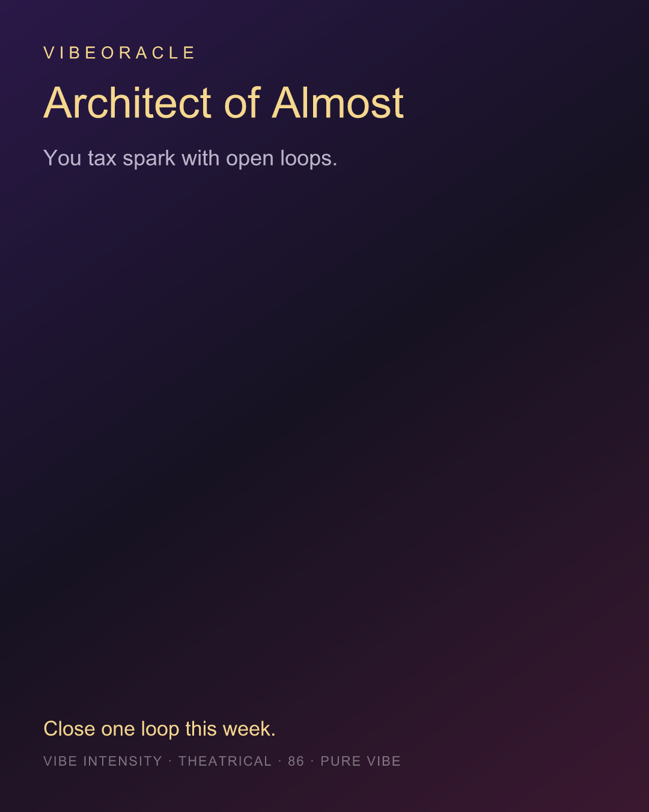

# VibeOracle

**Most AI oracles cosplay certainty. VibeOracle admits the theater — then still gives you a card.**

One mood in → three ritual cards → thin local engines → archetype · three moves · weekly taboo · share PNG.

> **Not evidence. Pure vibe.**  
> Confidence is **theatrical** (vibe intensity 72–92), never accuracy.  
> No silent “fake live.” Modes are honest: `live` | `demo` | `refused`.

<p align="center">
  <strong>▶ 15s product teaser</strong><br/>
  <a href="https://github.com/taipei49314/vibe-oracle/raw/master/docs/assets/demo-15s.mp4">docs/assets/demo-15s.mp4</a>
  · ~16s · hero + share card reveal
</p>

https://github.com/taipei49314/vibe-oracle/raw/master/docs/assets/demo-15s.mp4

<p align="center">
  
</p>

<p align="center">
  
</p>

<p align="center">
  <a href="#quick-start"></a>
  <a href="#why-this-exists"></a>
  <a href="LICENSE"></a>
  <a href="#security-posture"></a>
</p>

---

## Why this exists

AI “life advice” apps usually do one of two things:

1. **Fake science** — confidence scores, charts, “evidence” they can’t support.  
2. **Vague wellness** — affirmations with no texture, no ritual, no shareable spine.

VibeOracle picks a third lane:

| Instead of… | VibeOracle does… |
|-------------|------------------|
| Pretending measurements | Labels confidence as **theater** |
| Black-box one-shot chat | **Thin engines** stamp structured facts first (deck, day-seed, weekday, hexagram, lunar) |
| Silent offline fakes | Explicit `mode: "demo"` when no key / public demo |
| Open LLM free-for-all | Policy soft-refuse, rate limits, canary, OG budgets |

It’s a **ritual product with engineering teeth** — entertainment first, honesty about what it is.

---

## What you get in 30 seconds

1. Type a mood (“I abandon projects at 80%”).  
2. Draw three emotion cards (past / present / horizon).  
3. Engines stamp facts **locally** (no network).  
4. Live xAI reading **or** full offline demo script.  
5. Share text + **Satori PNG** (`GET /api/og`).

```text
mood → policy → engines → (LLM | demo | refuse) → report + share card
```

---

## Quick start

```bash
git clone https://github.com/taipei49314/vibe-oracle.git
cd vibe-oracle
cp .env.example .env
npm install
npm run dev
```

| Surface | URL |
|---------|-----|
| Client | http://localhost:5173 |
| API | http://localhost:8787 |

**No `XAI_API_KEY`?** Still works — complete **demo** reports, labeled `mode: "demo"`.

Optional live oracle:

```bash
# .env
XAI_API_KEY=...
XAI_BASE_URL=https://api.x.ai/v1
XAI_MODEL=grok-4.5
```

One-shot API check (no UI):

```bash
npm run demo:api
```

---

## Stack

| Layer | Choice |
|-------|--------|
| Client | Vite · React · Tailwind |
| API | Hono · Zod · Vitest |
| LLM | OpenAI-compatible → **xAI / SpaceXAI** |
| Engines | Pluggable, local-only (`registry.ts`) |
| Share | Canvas fallback + **Satori** OG |

---

## Scripts

| Command | What |
|---------|------|
| `npm run dev` | API + client |
| `npm run check` | tests + prompt lock + build |
| `npm run eval:prompts` | system-prompt / policy lock |
| `npm run demo:api` | curl-style demo against running API |
| `npm run smoke` | health + oracle smoke |

---

## API (short)

```http
POST /api/oracle
Content-Type: application/json

{ "mood": "I keep starting things and abandoning them at 80%" }
```

```json
{
  "mode": "demo",
  "ritual": [/* 3 cards */],
  "facts": [/* mood, day_seed, weekday, hexagram, lunar, cards */],
  "report": {
    "archetype": { "name": "Architect of Almost", "tagline": "…" },
    "actions": ["…", "…", "…"],
    "taboo": "…",
    "confidenceTheater": 86,
    "shareLine": "…"
  },
  "meta": { "requestId": "…", "day": "…", "confidenceLabel": "theatrical" }
}
```

Also: `GET /api/health` · `GET /api/ready` · `GET /api/og?...` (PNG)

<details>
<summary><strong>Security posture</strong> (folded — for operators)</summary>

- Mood ≤ 500 code points · body ≤ 8 KiB  
- IP rate limits · live budgets only **after** content policy · OG rate limit + in-flight  
- `TRUST_PROXY` default **false**; production: `cf-only` + edge firewall (see [cloudflare-rate-limit.md](docs/cloudflare-rate-limit.md))  
- Soft refuse: crisis / medical / legal / investment / injection  
- Prompt canary + output guard on live path  
- Never silent live → demo on LLM failure  

Full production env blocks: [docs](#design--docs) / `.env.example`

</details>

---

## What this is not

- Not medical, legal, or investment advice  
- Not crisis counseling — [IASP resources](https://www.iasp.info/suicidalthoughts/)  
- Not an “evidence” or research harness  
- Not a full classical I Ching / bazi stack (hexagram is **theatrical structure**)

---

## Design & docs

| Doc | For |
|-----|-----|
| [CONTRIBUTING.md](CONTRIBUTING.md) | How to extend engines / PR hygiene |
| [SECURITY.md](SECURITY.md) | Reporting & trust model |
| [docs/parts-registry.md](docs/parts-registry.md) | OSS harvest map |
| [docs/blue-team-remediation-design.md](docs/blue-team-remediation-design.md) | Hardening design |
| [docs/cloudflare-rate-limit.md](docs/cloudflare-rate-limit.md) | Multi-IP edge |

---

## Suggested GitHub topics

`oracle` · `llm` · `vite` · `react` · `hono` · `tarot` · `local-first` · `xai` · `spacexai` · `typescript`

---

## License

[MIT](LICENSE) · Built for the weird, honest, unfinished chapter.
