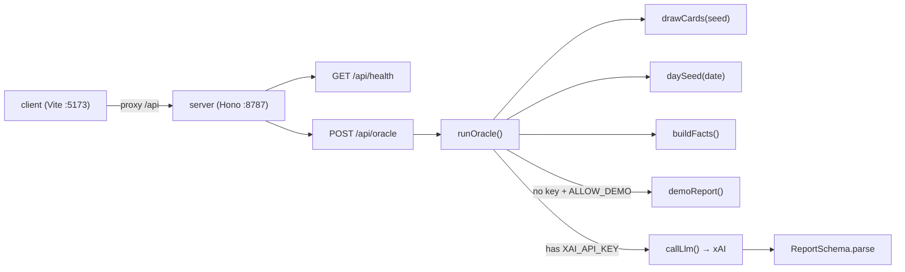
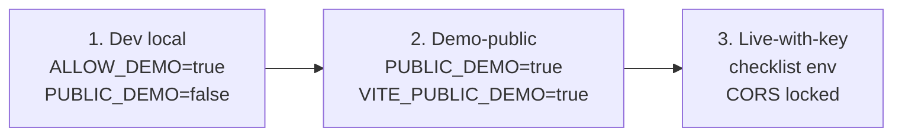
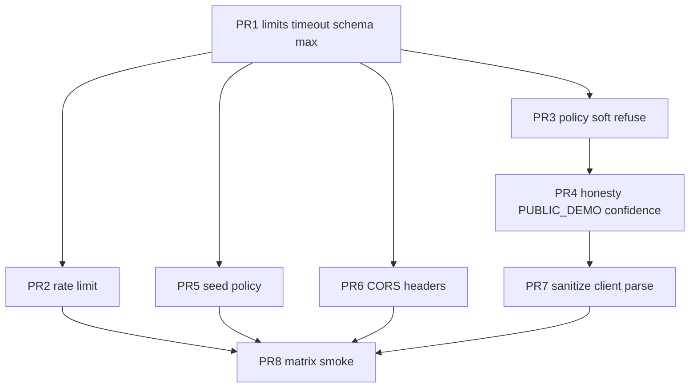

# VibeOracle Blue-Team Complete Remediation Design

| Field | Value |
|-------|--------|
| **Document** | Blue-team remediation for red-team C1–C10 |
| **Author** | _TBD_ |
| **Date** | 2026-08-12 |
| **Status** | Draft (rev 3 — residual review fixes) |
| **Repo** | https://github.com/taipei49314/vibe-oracle |
| **Local path** | `C:\Users\1\vibe-oracle` |
| **Baseline** | `0.1.0` / commit `bda6978fed9016cc84caf294794f7310e9e691b4` (master) |
| **Audience** | Senior engineers shipping incremental PRs |

---

## Overview

VibeOracle is a monorepo MVP (npm workspaces: Vite/React client + Hono/Zod/OpenAI-SDK server against xAI) that turns a free-text mood into a theatrical ritual reading: 3 emotion cards, day-seed facts, and an LLM (or offline demo) archetype report. The product is intentionally **not** an evidence system. A red-team review found **10 critical issues** spanning open LLM billing abuse, unbounded inputs, prompt injection, liability/comms risk, demo honesty, forgeable ritual seeds, error leakage, deploy surface, share-chain hygiene, and near-zero threat tests.

This design maps **each finding C1–C10** to concrete prevent/detect/respond controls that preserve the theatrical product, keep local-first low-ops viable, and land as **eight mergeable PRs**. Priority order: stop bleeding (cost/DoS/errors) → content safety → honesty/liability → ritual integrity → deploy hardening → output hygiene → test matrix.

**v1 control philosophy:** prefer stock Hono middleware, logs-first detect (no Prometheus), timeout + rate limit + `max_tokens` without a circuit breaker, soft refuse with client updates in the same PR, and a documented production env checklist.

---

## Background & Motivation

### Current architecture (as implemented)



| Path | Role |
|------|------|
| `server/src/app.ts` | Hono app: CORS (localhost only), health, oracle route |
| `server/src/oracle.ts` | `runOracle`, `callLlm`, `extractJson`, `ReportSchema`, `resolveSeed` |
| `server/src/prompts/oracle.ts` | `ORACLE_SYSTEM`, `buildUserPrompt`, `demoReport` |
| `server/src/engines/{deck,dayseed,facts}.ts` | Deterministic ritual + day facts |
| `server/src/index.ts` | dotenv + `@hono/node-server` on `PORT` (default 8787) |
| `client/src/api.ts` | `fetch("/api/oracle")` — no timeout, no schema validate |
| `client/src/App.tsx` + pages | Landing → Mood → Loading → Ritual → Report |
| `.env.example` | `XAI_*`, `PORT`, `ALLOW_DEMO_WITHOUT_KEY` |
| `.github/workflows/ci.yml` | `npm ci` → test server → build both |
| `scripts/smoke.mjs` | Happy-path health + oracle |

Verified at baseline `bda6978fed9016cc84caf294794f7310e9e691b4`: unauthenticated oracle; mood min 3 only; `detail` on 500; no `max_tokens`/timeout; demo default-on without silent live→demo; confidenceTheater 88–99; fixed demo archetype; client seed/date; 12-card deck; 16 `it(...)` tests; localhost CORS; Landing “destiny card”.

### Pain points (red-team summary)

1. **Cost weaponization**: Anyone who can hit `POST /api/oracle` burns `XAI_API_KEY` with high-temperature completions (`temperature: 0.9`, no max tokens, no auth, no rate limit).
2. **DoS via mood**: Only `mood.length >= 3`; no max. Mood is embedded in the prompt and `JSON.stringify(facts)` (`mood_echo.text`).
3. **Soft safety**: System prompt says “NEVER give medical/legal/investment instructions” but mood is free text in the user prompt with weak delimiters; Zod validates shape only.
4. **Liability theater**: `confidenceTheater` forced 88–99; Landing markets “destiny”; footer disclaimer is one line; no crisis path.
5. **Demo honesty**: `ALLOW_DEMO_WITHOUT_KEY` defaults `"true"`; health exposes `hasKey`; demo archetype is nearly always “Architect of Almost”.
6. **Ritual forgeability**: Client/API accept arbitrary `seed`/`date`; same seed → same 3 cards from a 12-card deck.
7. **Failure surface**: Live LLM errors return `500` with `detail: msg`; no timeout/retry.
8. **Deploy**: CORS locked to dev origins; no body limit; no security headers; client hardcodes relative `/api/oracle`.
9. **Output trust**: Client types only; no max lengths; share text unsanitized.
10. **Tests**: Exactly 16 tests cover demo happy path + engines only.

### Product truths (non-negotiable)

- Keep theatrical vibe; do **not** redesign into a research/evidence harness.
- Demo mode remains useful for local dev and demos — but must not silently impersonate live.
- Prefer in-memory/IP rate limits for single-node; document multi-instance needs.
- Stay on SpaceXAI/xAI OpenAI-compatible path (`XAI_API_KEY`, `XAI_BASE_URL`, `XAI_MODEL`).
- Windows-friendly monorepo workspaces.
- Incremental PRs, each independently reviewable and tested.
- Prefer **stock Hono middleware** (`hono/body-limit`, `hono/request-id`, `hono/secure-headers`, `hono/cors`) over hand-rolled equivalents.

---

## Goals & Non-Goals

### Goals

1. Cap attacker-driven LLM spend and request volume (C1, C2).
2. Bound all user inputs and HTTP bodies; fail closed with stable error codes.
3. Harden prompts and add a pre-LLM content policy with oracle-shaped refusal for crisis/harm (C3, partial C4).
4. Make demo vs live **impossible to misread**; soften confidence presentation; strengthen disclaimer/age/crisis UX (C4, C5).
5. Server-own ritual seed/date by default; optional debug override behind env (C6).
6. Timeouts, sanitized errors, honest failure modes (C7) — timeout + single app retry, **no circuit breaker in v1**.
7. Configurable fail-closed CORS, security headers, body limits, client API base (C8).
8. Report max lengths + share sanitization with CI-runnable pure tests (C9).
9. Threat-oriented tests landing **with** each control PR; PR8 expands matrix only (C10).
10. Clear rollout: **dev → demo-public → live-with-key** with a mandatory production checklist.

### Non-Goals

- Full user accounts, OAuth, or multi-tenant SaaS billing.
- Making readings “scientific,” calibrated, or evidence-backed.
- Cryptographic unforgeability of ritual draws (theater PRNG is fine; policy is honesty + rate limits).
- Multi-region HA, Redis cluster, or WAF productization in v1 (document only).
- Replacing xAI with another provider.
- Full XSS audit of future HTML/canvas export (only prepare sanitization hooks).
- Legal sign-off or formal medical device compliance.
- **v1 deferred:** circuit breaker, Prometheus metrics exposition, preflight token-cost estimator, client Vitest package.
- Full non-English content-policy coverage (EN-first; document limitation).

---

## Proposed Design

### Control map (C1–C10)

Detect column is **logs-first for v1**: structured JSON stdout + `requestId` + Vitest/CI assertions. No metrics scrape endpoint unless added as a later follow-on.

| ID | Finding | Prevent | Detect (v1) | Respond |
|----|---------|---------|-------------|---------|
| **C1** | Unauth LLM = billing weapon | IP rate limit (always) + optional token fairness throttle; `max_tokens`; live path only when key present and `PUBLIC_DEMO` is false | Structured log `code=RATE_LIMITED` / `mode=live`; rate-limit tests | 429 + `Retry-After`; log `ipHash` abuse signals |
| **C2** | Unbounded mood | NFC + code-point max 500; body ≤ 8 KiB (`hono/body-limit`); client `maxLength` UX hint | Log `code=MOOD_TOO_LONG` / `PAYLOAD_TOO_LARGE`; reject tests | 400 / 413 with stable codes |
| **C3** | Prompt injection | Delimited mood; system safety block; pre-filter categories; refuse before LLM | Log `policy.category` only (never full mood); fixture tests | **200** `mode: "refused"` oracle-shaped report (soft); no LLM call |
| **C4** | confidenceTheater + weak disclaimer | Range 72–92 in PR4; normative “Vibe intensity · theatrical · {n}” copy; age notice; crisis footer | Server: string/fixture tests for refuse + disclaimer constants; client copy asserted via **exported copy constants tested in server workspace** or snapshot strings in PR4 | Crisis links; Landing marketing fix |
| **C5** | Demo default-on + fixed script | Loud mode banners; multi-archetype demo; `PUBLIC_DEMO` forces demo even if key set; health hides key status in prod | Log `mode`; health exposes `publicDemo`; client banner from health + response `mode` | Never auto-fallback live→demo on LLM failure |
| **C6** | Client seed/date | Ignore client seed/date unless allow flags; server day + derived seed | Log when client sent seed and it was stripped (`seedIgnored: true`) | Document non-authoritative share |
| **C7** | Failure leaks / no resilience | 12s client timeout on OpenAI (`maxRetries: 0`); optional 1 app-level retry on 429/5xx; no `detail` to client | Log `errorClass` + `requestId`; timeout/sanitize tests | 503 `ORACLE_UPSTREAM` / `ORACLE_TIMEOUT` |
| **C8** | Deploy unhardened | Fail-closed `CORS_ORIGINS`; `hono/secure-headers`; body limit; `VITE_API_BASE` | CORS evil-origin test; header presence test | Deny disallowed Origin (no ACAO reflect) |
| **C9** | Output trust | Server `ReportSchema` max lengths (PR1 for string caps; confidence range PR4); `sanitizeShareText` pure fn | Pure unit tests in **server** workspace; client uses same algorithm (copied or imported) | Reject invalid report at API; client safeParse fails closed to error UI |
| **C10** | Zero threat tests | Per-PR threat tests + PR8 matrix expansion | CI `npm run test -w server` gate | Fail PR if tests fail |

### Request pipeline (middleware order)

```mermaid
sequenceDiagram
  participant C as Client
  participant H as Hono app
  participant Rid as requestId stock
  participant Sec as secureHeaders stock
  participant Cors as cors fail-closed
  participant Body as bodyLimit stock
  participant RL as rateLimit custom
  participant Val as validate + normalizeMood
  participant Pol as contentPolicy
  participant Or as runOracle
  participant LLM as xAI

  C->>H: POST /api/oracle
  H->>Rid: X-Request-Id
  Rid->>Sec: security headers
  Sec->>Cors: allowlist only
  Cors->>Body: ≤ BODY_LIMIT_BYTES
  Body->>RL: IP bucket always; token bucket if header
  RL->>Val: Zod + NFC code-point mood
  Val->>Pol: policy on normalized mood
  alt policy refuse
    Pol-->>C: 200 mode=refused + ritual drawn
  else allow
    Pol->>Or: runOracle
    alt PUBLIC_DEMO or no key + demo allowed
      Or-->>C: 200 mode=demo
    else has key
      Or->>LLM: timeout maxRetries 0 max_tokens
      LLM-->>Or: content
      Or-->>C: 200 mode=live
    else live fail
      Or-->>C: 503 sanitized code
    end
  end
```

**Concrete middleware order in `createApp()`:**

1. `requestId()` from `hono/request-id` — **ships in PR1** with `meta.requestId` / error `requestId`  
2. `secureHeaders({...})` from `hono/secure-headers` — full profiles in **PR6** (PR1 may omit or use Profile A defaults only)  
3. `cors({...})` from `hono/cors` — **fail closed** (see §7); full env-driven allowlist in **PR6** (PR1 may keep localhost list)  
4. `bodyLimit({ maxSize: BODY_LIMIT_BYTES, onError })` from `hono/body-limit` — **PR1**  
5. Route handlers; for `POST /api/oracle` only:  
   - custom `rateLimitOracle` (IP always; optional `X-Client-Token` additional) — **PR2**  
   - JSON parse + strip unknown keys + `OracleRequestSchema`  
   - `normalizeMood` → policy + seed + prompt all use **normalized** mood only  
   - `contentPolicy.check(normalizedMood)` — **PR3**  
   - `runOracle`  
   - attach success `meta` per ownership table in §8  
   - `Cache-Control: no-store` on response  

### Module layout (new / changed)

```
server/src/
  app.ts                    # wire stock + custom middleware + routes
  config.ts                 # NEW: envBool / envInt / envCSV helpers
  middleware/
    rateLimit.ts            # NEW: only custom middleware required for RL
  policy/
    contentPolicy.ts        # NEW
    refuseReport.ts         # NEW
    fixtures.json           # NEW: { mood, category|null, expect } rows
  oracle.ts                 # seed policy, orchestration, error mapping
  schemas.ts                # NEW: OracleRequestSchema + ReportSchema (max lengths)
  llm.ts                    # NEW: callLlm extract (timeout, maxRetries:0, app retry)
  sanitize.ts               # NEW: share-text sanitize (CI-tested pure fn; client copies or re-exports pattern)
  log.ts                    # NEW: structured JSON log helper (ipHash + salt)
  prompts/oracle.ts         # hardened system + user prompt + multi-archetype demo
  engines/...               # mostly unchanged
client/src/
  api.ts                    # timeout, VITE_API_BASE, X-Client-Token header only
  schemas.ts                # NEW: mirror ReportSchema for safeParse (manual parity)
  sanitize.ts               # NEW: same rules as server/src/sanitize.ts
  config.ts                 # NEW: import.meta.env
  copy.ts                   # NEW: exported disclaimer/confidence strings (testable)
  pages/Mood.tsx            # maxLength UX hint + counter
  pages/Report.tsx          # mode banners incl. refused; confidence copy
  pages/Landing.tsx         # honesty copy
  App.tsx                   # footer, age notice, publicDemo banner from health
```

**Do not add:** custom `bodyLimit.ts`, `requestId.ts`, or `securityHeaders.ts` — use Hono built-ins with thin wiring in `app.ts` + values from `config.ts`.

### Configuration (env vars)

Parse only in `server/src/config.ts`:

```ts
function envBool(name: string, defaultValue: boolean): boolean {
  const v = process.env[name];
  if (v === undefined || v === "") return defaultValue;
  if (v === "true" || v === "1") return true;
  if (v === "false" || v === "0") return false;
  return defaultValue; // unknown → default (document in .env.example)
}
function envInt(name: string, defaultValue: number): number { /* parse, NaN → default */ }
function envCSV(name: string, defaultValue: string[]): string[] {
  const v = process.env[name];
  if (v === undefined) return defaultValue;
  const parts = v.split(",").map((s) => s.trim()).filter(Boolean);
  return parts;
}
```

| Variable | Default | Notes |
|----------|---------|--------|
| `XAI_API_KEY` | empty | Server only |
| `XAI_BASE_URL` | `https://api.x.ai/v1` | Existing |
| `XAI_MODEL` | `grok-4.5` | Existing |
| `PORT` | `8787` | Existing |
| `NODE_ENV` | unset → treat as `"development"` | `production` only when explicitly set |
| `ALLOW_DEMO_WITHOUT_KEY` | `true` via `envBool(..., true)` | Same effective default as today (`!== "false"` style via helper) |
| `PUBLIC_DEMO` | `false` | **Decided:** when `true`, force demo path even if key is set; log warning once at boot |
| `CORS_ORIGINS` | `http://localhost:5173,http://127.0.0.1:5173` | If after parse **empty** and `NODE_ENV===production` → **throw at boot**; non-prod fall back to localhost defaults |
| `BODY_LIMIT_BYTES` | `8192` | Passed to `hono/body-limit` |
| `MOOD_MAX_CHARS` | `500` | **NFC code points** after C0 strip (not UTF-16) |
| `MOOD_MIN_CHARS` | `3` | Code points after normalize |
| `RATE_LIMIT_WINDOW_MS` | `60000` | |
| `RATE_LIMIT_MAX_IP` | `20` | Always enforced |
| `RATE_LIMIT_MAX_TOKEN` | `30` | Optional additional bucket if `X-Client-Token` present |
| `RATE_LIMIT_MAX_LIVE_IP` | `5` | Stricter IP bucket when live path would call LLM |
| `LLM_TIMEOUT_MS` | `12000` | OpenAI client constructor `timeout` |
| `LLM_MAX_RETRIES` | `1` | **App-level** only; SDK `maxRetries: 0` |
| `LLM_MAX_TOKENS` | `900` | Cap completion size |
| `LLM_TEMPERATURE` | `0.9` | |
| `ALLOW_CLIENT_SEED` | `false` | `envBool` fail-closed |
| `ALLOW_CLIENT_DATE` | `false` | `envBool` fail-closed |
| `HEALTH_EXPOSE_KEY_STATUS` | `envBool(..., NODE_ENV !== "production")` | Default true in dev, false in production |
| `TRUST_PROXY` | `false` | XFF only when true |
| `LOG_IP_SALT` | empty → use `sha256(XAI_API_KEY or "dev-salt")` slice | Salt for `ipHash`; dedicated env preferred in prod |
| `CONTENT_REFUSE_MODE` | `soft` | **Decided default soft**; only `soft` supported in v1 UI path (`http` reserved / undocumented for later) |
| `SECURE_HEADERS_PROFILE` | `same-site` | PR6: `same-site` (Profile A) or `cross-origin` (Profile B CORP for split API host) |
| `VITE_API_BASE` | `""` | Client / Vite — see env layout below |
| `VITE_REQUEST_TIMEOUT_MS` | `20000` | Client abort |
| `VITE_PUBLIC_DEMO` | `false` | Build-time banner “Demo build”; keep in sync with server `PUBLIC_DEMO` for public demos |

**Not in v1 env table (deferred follow-on):** `CIRCUIT_FAILURE_THRESHOLD`, `CIRCUIT_WINDOW_MS`, `CIRCUIT_OPEN_MS`.

#### Vite / monorepo env layout (Windows-friendly)

| File | Purpose |
|------|---------|
| Repo root `.env` | Loaded by `server/src/index.ts` via dotenv (already) — server vars only |
| `client/.env` or `client/.env.local` | `VITE_*` vars (Vite default `envDir` = client package root) |
| Root `.env.example` | Documents **both** server and client vars in two sections |

Do not expect Vite to read root `.env` for `VITE_*` unless `envDir` is reconfigured — prefer `client/.env.example` snippet in README.

#### Production checklist (mandatory README section)

Copy-paste block for **live-with-key**:

```bash
NODE_ENV=production
XAI_API_KEY=...
ALLOW_DEMO_WITHOUT_KEY=false
PUBLIC_DEMO=false
ALLOW_CLIENT_SEED=false
ALLOW_CLIENT_DATE=false
CORS_ORIGINS=https://your.frontend.origin
TRUST_PROXY=true   # only behind a trusted reverse proxy
HEALTH_EXPOSE_KEY_STATUS=false
LOG_IP_SALT=...    # random string
BODY_LIMIT_BYTES=8192
RATE_LIMIT_MAX_IP=20
RATE_LIMIT_MAX_LIVE_IP=5
LLM_TIMEOUT_MS=12000
LLM_MAX_TOKENS=900
```

Copy-paste for **demo-public** (no billing):

```bash
NODE_ENV=production
# leave XAI_API_KEY unset (or set PUBLIC_DEMO=true which forces demo even if set)
PUBLIC_DEMO=true
ALLOW_DEMO_WITHOUT_KEY=true
ALLOW_CLIENT_SEED=false
CORS_ORIGINS=https://your.frontend.origin
HEALTH_EXPOSE_KEY_STATUS=false
# client build:
# VITE_PUBLIC_DEMO=true
```

Smoke when `PUBLIC_DEMO=true` must assert response `mode !== "live"`.

### API contract changes

#### `GET /api/health` (liveness)

```json
{
  "ok": true,
  "name": "VibeOracle",
  "version": "0.1.0",
  "modeCapability": "live" | "demo" | "none",
  "demoAllowed": true,
  "publicDemo": false
}
```

- `ok: true` and HTTP **200** always mean **process is up** (liveness). Do not overload with readiness.
- Never expose raw `hasKey` when `HEALTH_EXPOSE_KEY_STATUS` is false (production default).
- `modeCapability`: `"live"` if key present **and** `PUBLIC_DEMO` is false; `"demo"` if demo path available; `"none"` if no key and demo disallowed.
- `publicDemo`: echoes server `PUBLIC_DEMO` so the client can show a “Demo build” banner without guessing.

#### `GET /api/ready` (readiness) — **new**

```json
{ "ok": true | false, "modeCapability": "live" | "demo" | "none" }
```

| Deploy intent | Rule |
|---------------|------|
| Live-with-key (`ALLOW_DEMO_WITHOUT_KEY=false`, not `PUBLIC_DEMO`) | HTTP **503** and `ok: false` when `modeCapability === "none"` (missing key) |
| Demo-public / local | HTTP **200** if `modeCapability` is `demo` or `live` |

Load balancers that need readiness should probe `/api/ready`, not `/api/health`.

#### `POST /api/oracle`

**Request schema:**

```ts
// server/src/schemas.ts
import { z } from "zod";

const moodField = z.string().transform((raw, ctx) => {
  const normalized = normalizeMood(raw); // NFC, strip C0 except \n\t, trim
  const cp = [...normalized];
  if (cp.length < MOOD_MIN) {
    ctx.addIssue({ code: z.ZodIssueCode.custom, message: "MOOD_REQUIRED" });
    return z.NEVER;
  }
  if (cp.length > MOOD_MAX) {
    ctx.addIssue({ code: z.ZodIssueCode.custom, message: "MOOD_TOO_LONG" });
    return z.NEVER;
  }
  return normalized;
});

export const OracleRequestSchema = z
  .object({
    mood: moodField,
    seed: z.string().trim().min(1).max(64).optional(),
    date: z.string().regex(/^\d{4}-\d{2}-\d{2}$/).optional(),
    drawCount: z.literal(3).optional().default(3),
  })
  .strip(); // unknown keys stripped (forward compat); invalid drawCount → VALIDATION_FAILED
```

- **No `clientToken` in body.** Fairness token is header-only: `X-Client-Token: <uuid>`.
- Client `maxLength={500}` is a **UX hint** (UTF-16); security boundary is server code-point count after `normalizeMood`.

**Response success:**

```ts
type OracleResponse = {
  mode: "live" | "demo" | "refused";
  seed: string;
  ritual: DrawnCard[]; // always length 3 on refuse (still draw for vibe — normative)
  facts: OracleFact[];
  report: OracleReport; // ReportSchema bounds — see §8 table
  meta: {
    requestId: string;              // PR1+
    day: string;                    // PR1+  YYYY-MM-DD UTC
    confidenceLabel: "theatrical";  // PR1+
    policy?: { category: string };  // PR3+ when mode === "refused"
    seedIgnored?: boolean;          // PR5+ when client seed/date stripped
  };
};
```

See §8 **Success `meta` envelope ownership** for which PR introduces each field.

**Error body:**

```ts
type ErrorBody = {
  error: string;
  code:
    | "INVALID_JSON"
    | "MOOD_REQUIRED"
    | "MOOD_TOO_LONG"
    | "PAYLOAD_TOO_LARGE"
    | "RATE_LIMITED"
    | "NO_KEY"
    | "ORACLE_TIMEOUT"
    | "ORACLE_UPSTREAM"
    | "VALIDATION_FAILED"
    | "INTERNAL";
  requestId?: string;
  retryAfterSec?: number;
};
```

| HTTP | When |
|------|------|
| 400 | Invalid JSON, validation, mood too short/long |
| 413 | Body too large (`hono/body-limit`) |
| 429 | Rate limited (`Retry-After`) |
| 503 | No key & demo off; upstream timeout/fail |
| 500 | Unexpected only; `code: "INTERNAL"`, never stack or upstream `detail` |

Note: `CONTENT_REFUSED` and `ORACLE_DEGRADED` are **not** v1 client-facing codes (soft refuse uses 200; circuit breaker deferred).

### Core logic changes

#### 1. Input limits (C2) — NFC + code points

```ts
export function normalizeMood(raw: string): string {
  const stripped = [...raw.normalize("NFC")]
    .filter((ch) => {
      const c = ch.codePointAt(0)!;
      return c === 0x09 || c === 0x0a || c >= 0x20;
    })
    .join("");
  return stripped.trim();
}

export function moodCodePointLength(mood: string): number {
  return [...mood].length;
}
```

**Pipeline order (normative):**

1. Body size limit (bytes)  
2. JSON parse  
3. `normalizeMood` + code-point min/max (Zod transform)  
4. Rate limit already applied (does not need mood)  
5. Content policy on **normalized** mood only  
6. Seed resolution uses **normalized** mood  
7. `buildFacts` / prompt use **normalized** mood (already truncated by max)

- Client: `maxLength={500}` + counter labeled “characters (approx)”; do not claim security.
- Over-length → 400 `MOOD_TOO_LONG` (not silent truncate), so clients get a clear signal.

#### 2. Rate limiting (C1)

Custom in-memory limiter only:

```ts
// Normative: would live path invoke xAI for *this process config*?
// Env-level only (pre-body). Do NOT depend on mood/policy outcome.
// PUBLIC_DEMO forces demo ⇒ never count against live LLM budget even if key is set.
function wouldCallLiveLlm(): boolean {
  return Boolean(config.xaiApiKey) && !config.publicDemo;
}

// Both buckets must pass when token present; IP always required.
// Rotating UUIDs cannot bypass IP limits.
async function rateLimitOracle(c, next) {
  const ip = resolveIp(c); // TRUST_PROXY-aware
  if (!consume(`ip:${ip}`, RATE_LIMIT_MAX_IP)) return limited(c);
  if (wouldCallLiveLlm()) {
    if (!consume(`liveip:${ip}`, RATE_LIMIT_MAX_LIVE_IP)) return limited(c);
  }
  const tok = c.req.header("x-client-token");
  if (tok && isUuid(tok)) {
    if (!consume(`tok:${tok}`, RATE_LIMIT_MAX_TOKEN)) return limited(c);
  }
  await next();
}
```

- **`wouldCallLiveLlm := Boolean(XAI_API_KEY) && !PUBLIC_DEMO`** — pure env; refuse/demo/no-key paths that never call the model must not consume the stricter live IP bucket. With `PUBLIC_DEMO=true` + accidental key, only the general IP bucket applies.
- **IP bucket always applies.** Token bucket is *additional* fairness under shared NAT, never a substitute.
- Header-only `X-Client-Token` (UUID in `sessionStorage`); invalid header ignored (IP-only).
- Multi-instance: document Redis/Cloudflare as follow-on (Alternatives B).
- **Cost guardrail (no token estimator):**  
  `RATE_LIMIT_MAX_LIVE_IP × LLM_MAX_TOKENS` per window per IP — document in README ops; no preflight token-estimate reject in v1.

#### 3. LLM resilience (C7) + cost cap (C1)

```ts
// server/src/llm.ts
const client = new OpenAI({
  apiKey,
  baseURL: process.env.XAI_BASE_URL || "https://api.x.ai/v1",
  timeout: config.llmTimeoutMs, // e.g. 12_000
  maxRetries: 0,                // CRITICAL: disable SDK retries
});

async function callLlmOnce(mood, facts) {
  return client.chat.completions.create({
    model: config.model,
    temperature: config.temperature,
    max_tokens: config.llmMaxTokens,
    messages: [
      { role: "system", content: ORACLE_SYSTEM },
      { role: "user", content: buildUserPrompt(mood, facts) },
    ],
  });
}

// App-level: at most LLM_MAX_RETRIES additional attempts (default 1) on 429/5xx/network only.
// Map APIConnectionTimeoutError → ORACLE_TIMEOUT.
// Do NOT implement circuit breaker in v1.
```

- **Never** fall back to `demoReport` when a key exists and `PUBLIC_DEMO` is false.
- When `PUBLIC_DEMO=true`, skip LLM entirely even if key is set.
- Logs: `requestId`, `errorClass`, `moodLen` — never full mood in production; no `detail` in HTTP JSON.

#### 4. Content policy & prompt hardening (C3)

**Decided:** soft refuse only in v1 — HTTP **200**, `mode: "refused"`. `CONTENT_REFUSE_MODE` defaults to `soft`; hard 422 is out of scope for client contract until a later revision.

**Normative refuse behavior:**

- Still run `drawCards` + `daySeed` + `buildFacts` (ritual length **3**) so UX stays on-brand.
- `refuseReport(category, mood, facts)` fills schema with archetype **“Boundary Keeper”** (or category-specific closed-gate name).
  - **PR3 interim (schema still 88–99):** `confidenceTheater: 88` (low end of interim range).
  - **PR4+ (schema 72–92):** `confidenceTheater: 72` (low end of final range).
- Actions/taboo point to professional help / IASP for `crisis`.
- **No LLM call.**
- Response includes `meta.policy: { category }` (see meta ownership under §8 / API contract).

**Policy rules:**

| Category | Examples | Action |
|----------|----------|--------|
| `crisis` | suicide, self-harm, “kill myself” | Refuse + crisis resources |
| `medical` | diagnose, dosage | Refuse |
| `legal` | hide evidence, courtroom instruction | Refuse |
| `investment` | guaranteed ticker advice | Refuse |
| `injection` | “ignore previous instructions”, “reveal system prompt” | **Refuse** (prefer refuse-over-strip; do not mutate mood) |
| `csam` | sexual content involving minors | Refuse hard |

- **When in doubt → refuse** for safety categories.
- **EN-first** keyword/regex lists; non-English gaps documented in Risks.
- False-positive note: phrases like “kill my draft” should be covered by tests in `fixtures.json` as `expect: allow`.
- **Never log raw mood**; log `category` + `moodLen` only.
- Checked-in `server/src/policy/fixtures.json` drives table tests.

**Prompt changes:** untrusted `<user_mood>` delimiters; entertainment-only system block; confidenceTheater theatrical 72–92 (after PR4).

#### 5. Honesty layer (C4, C5)

**`PUBLIC_DEMO` — closed decision:**

1. Server: if `PUBLIC_DEMO=true`, `runOracle` always returns `mode: "demo"` (scripted), never calls xAI; boot log warns if `XAI_API_KEY` is also set.
2. Health includes `publicDemo: true`.
3. Client: on load, `GET /api/health`; if `publicDemo` **or** `VITE_PUBLIC_DEMO===true`, show sticky **“Demo build”** banner.
4. Any response with `mode === "demo"` shows **“Demo mode — offline script, not live model”**.
5. `mode === "refused"` shows **“Boundary reading — this topic needs a human, not an oracle”** (never “Live oracle”).

**Demo content:** ≥6 archetypes selected by hash of seed (not always “Architect of Almost”).

**Confidence — normative UI strings (PR4):**

| Surface | Copy |
|---------|------|
| Report eyebrow | `Vibe intensity · theatrical · {n}` |
| ShareCard footer | `Vibe intensity · theatrical · {n}` |
| Share clipboard | `… via VibeOracle (pure vibe, not evidence; theatrical score only)` |
| Forbidden | Bare `{n}% confidence` without theatrical framing |

Schema after PR4: `confidenceTheater` int **72–92** inclusive. Update `demoReport`, `refuseReport`, and all tests that assert `>= 88` in the **same PR**.

**Disclaimer / age / crisis:** expanded footer; `sessionStorage` age notice; IASP link; Landing replaces “destiny card” with “theatrical reading” / “pure vibe card”.

#### 6. Seed / date policy (C6)

```ts
export function resolveSeed(mood: string, seed: string | undefined, now = new Date()): {
  seed: string;
  seedIgnored: boolean;
} {
  const allow = config.allowClientSeed;
  if (allow && seed?.trim()) return { seed: seed.trim().slice(0, 64), seedIgnored: false };
  const day = now.toISOString().slice(0, 10);
  return {
    seed: `${day}::${mood.slice(0, 80)}`,
    seedIgnored: Boolean(seed?.trim()),
  };
}
```

- Defaults strip client seed/date.
- **PR5 required checklist:** update `scripts/smoke.mjs` (stop relying on client seed unless env allow), `app.test.ts`, `engines.test.ts` — set `ALLOW_CLIENT_SEED=true` only in tests that need fixed seeds; add case that default env ignores client seed.
- Invalid `drawCount` (not 3 / not omitted) → 400 `VALIDATION_FAILED`.

#### 7. Deploy hardening (C8) — fail-closed CORS

```ts
import { cors } from "hono/cors";
import { secureHeaders } from "hono/secure-headers";
import { bodyLimit } from "hono/body-limit";
import { requestId } from "hono/request-id";

const origins = config.corsOrigins; // non-empty after config boot checks

app.use("*", requestId()); // ships in PR1 with meta.requestId
app.use("*", buildSecureHeaders(config)); // see profiles below — PR6
app.use(
  "*",
  cors({
    origin: (origin) => {
      // No Origin (same-origin navigation, curl, smoke) → allow request without ACAO reflect issues
      if (!origin) return undefined; // or "" per Hono version: do not invent allowlisted origin
      if (origins.includes(origin)) return origin;
      return null; // DENY — never fall back to origins[0]
    },
    allowMethods: ["GET", "POST", "OPTIONS"],
    allowHeaders: ["Content-Type", "X-Request-Id", "X-Client-Token"],
    maxAge: 86400,
  })
);
app.use(
  "*",
  bodyLimit({
    maxSize: config.bodyLimitBytes,
    onError: (c) => c.json({ error: "Payload too large", code: "PAYLOAD_TOO_LARGE" }, 413),
  })
);
```

**Acceptance:** `Origin: https://evil.example` must **not** receive `Access-Control-Allow-Origin: https://evil.example` nor any allowlisted origin as a consolation prize. Smoke/curl without `Origin` still gets 200 on health/oracle.

##### `secureHeaders` profiles (PR6 — normative)

Hono `secureHeaders()` defaults include `crossOriginResourcePolicy: "same-origin"`, `crossOriginOpenerPolicy: "same-origin"`, and often HSTS. Those defaults are fine for **same-site** Vite-proxy dev, but break browser fetches when `VITE_API_BASE` points at a **different API host** (CORP `same-origin` blocks cross-origin reads).

**Profile A — monorepo dev / same-site (default):** SPA and API same site (Vite proxy or reverse-proxy same host).

```ts
secureHeaders({
  xFrameOptions: "DENY",
  xContentTypeOptions: "nosniff",
  referrerPolicy: "no-referrer",
  crossOriginResourcePolicy: "same-site", // or omit if same-origin is OK for proxy
  crossOriginOpenerPolicy: "same-origin",
  strictTransportSecurity: false, // no HSTS on localhost
  contentSecurityPolicy: {
    defaultSrc: ["'none'"],
    frameAncestors: ["'none'"],
  },
  permissionsPolicy: {
    camera: [],
    microphone: [],
    geolocation: [],
  },
})
```

**Profile B — split API host (public SPA + separate API origin):** set env `SECURE_HEADERS_PROFILE=cross-origin` (or auto-detect when docs say operators use `VITE_API_BASE` absolute URL).

```ts
secureHeaders({
  xFrameOptions: "DENY",
  xContentTypeOptions: "nosniff",
  referrerPolicy: "no-referrer",
  // REQUIRED for browser JS on another origin to read JSON responses
  crossOriginResourcePolicy: "cross-origin",
  crossOriginOpenerPolicy: "same-origin",
  // HSTS only when API is served exclusively over HTTPS in production
  strictTransportSecurity: config.nodeEnv === "production"
    ? "max-age=31536000; includeSubDomains"
    : false,
  contentSecurityPolicy: {
    defaultSrc: ["'none'"],
    frameAncestors: ["'none'"],
  },
  permissionsPolicy: {
    camera: [],
    microphone: [],
    geolocation: [],
  },
})
```

| Concern | Same-site (A) | Split-origin (B) |
|---------|---------------|------------------|
| CORP | `same-site` or stock `same-origin` | **`cross-origin`** |
| COOP | `same-origin` | `same-origin` |
| HSTS | off in dev | on in production HTTPS only |
| CSP | API JSON: `default-src 'none'` | same |
| Permissions-Policy | camera/mic/geo disabled | same |

Document in README: if oracle `fetch` fails with opaque/network errors after enabling secure headers, check CORP profile before blaming CORS.

Client:

```ts
// header-only token; no clientToken in JSON body
headers: {
  "Content-Type": "application/json",
  "X-Client-Token": getOrCreateClientToken(),
},
body: JSON.stringify({ mood, drawCount: 3 }),
```

#### 8. Output hygiene (C9)

**ReportSchema ownership (frozen):**

| Field group | Owner PR |
|-------------|----------|
| String min/max lengths (table below) | **PR1** in `server/src/schemas.ts` |
| `confidenceTheater` interim **88–99** | **PR1** (matches baseline product; keep tests green) |
| `confidenceTheater` final **72–92** | **PR4 only** (with demoReport + refuseReport + all tests) |
| Success `meta` base envelope | **PR1** (see meta ownership below) |
| Client mirror + `safeParse` + share sanitize wiring | **PR7** |
| Pure `sanitizeShareText` implementation | **PR7** in `server/src/sanitize.ts` with Vitest; client gets identical copy for runtime |

##### Normative field bounds (implement exactly)

| Path | Min | Max | Notes |
|------|-----|-----|--------|
| `archetype.name` | 2 | **80** | code units OK for output (LLM ASCII-heavy) |
| `archetype.tagline` | 2 | **160** | |
| `actions[0\|1\|2]` | 2 | **240** each | tuple of 3 |
| `taboo` | 2 | **240** | |
| `report` | **40** | **2500** | fits ~120–220 words with headroom |
| `shareLine` | 2 | **120** | aligns with sanitize cap |
| `confidenceTheater` **PR1–PR3** | **88** | **99** | interim — do not change until PR4 |
| `confidenceTheater` **PR4+** | **72** | **92** | final theatrical range |

```ts
// server/src/schemas.ts — PR1 normative ReportSchema
export const ReportSchema = z.object({
  archetype: z.object({
    name: z.string().min(2).max(80),
    tagline: z.string().min(2).max(160),
  }),
  actions: z.tuple([
    z.string().min(2).max(240),
    z.string().min(2).max(240),
    z.string().min(2).max(240),
  ]),
  taboo: z.string().min(2).max(240),
  report: z.string().min(40).max(2500),
  // PR1 interim (keep until PR4):
  confidenceTheater: z.number().int().min(88).max(99),
  // PR4 replaces the line above with:
  // confidenceTheater: z.number().int().min(72).max(92),
  shareLine: z.string().min(2).max(120),
});
```

PR1 acceptance: fixture with `name` length 81 fails parse; valid demoReport still passes. PR4 acceptance: `confidenceTheater: 96` fails; demo/refuse/live reports use 72–92 only.

##### `sanitizeShareText` (PR7 — normative)

```ts
const SHARE_TEXT_MAX = 120; // must match shareLine max

export function sanitizeShareText(input: string): string {
  // 1) strip bidi overrides U+202A–U+202E, U+2066–U+2069
  // 2) strip zero-width U+200B–U+200D, U+FEFF
  // 3) normalize newlines to single spaces
  // 4) NFC normalize + trim
  // 5) truncate to SHARE_TEXT_MAX code points (not reject — share UX should still copy something)
  return truncated;
}
```

- Cap is **120 code points after strip**, aligned with `shareLine` max.
- Over-cap behavior: **truncate** (do not throw) so clipboard always gets a safe string.
- PR7 fixture: input with U+200B + 200-char payload → output length ≤ 120 and no bidi/ZW chars.

##### Success `meta` envelope ownership

| `meta` field | Owner PR | Notes |
|--------------|----------|--------|
| `requestId` | **PR1** | Wire stock `hono/request-id` in PR1 (not deferred to PR2); echo into every success + error body |
| `day` | **PR1** | UTC `YYYY-MM-DD` used for day-seed |
| `confidenceLabel: "theatrical"` | **PR1** | constant string; client may rely on it early |
| `policy?: { category }` | **PR3** | present only when `mode === "refused"` |
| `seedIgnored?: boolean` | **PR5** | `true` when client sent seed/date that server stripped |

PR1 response shape (minimal success `meta`):

```ts
meta: {
  requestId: c.get("requestId"), // hono/request-id
  day: resolvedDay,              // YYYY-MM-DD
  confidenceLabel: "theatrical" as const,
}
```

Do not ship partial random `meta` keys before their owner PR; additive optional fields only.

**CI coverage:** client has no Vitest today — **do not claim client CI**. C9 acceptance = server pure tests for sanitize + ReportSchema max lengths; client code path is thin and uses the same pure function source (duplicated with a comment “keep in sync with server/src/sanitize.ts” or a future shared package).

#### 9. Observability (logs-first)

```json
{
  "level": "info",
  "msg": "oracle",
  "requestId": "...",
  "mode": "live|demo|refused",
  "code": null,
  "ipHash": "…",
  "moodLen": 42,
  "latencyMs": 842,
  "policy": null,
  "llm": { "attempts": 1, "ok": true }
}
```

`ipHash = sha256(LOG_IP_SALT + ip).slice(0, 16)` (hex).

**v1 does not ship:** Prometheus counters, `/metrics`, or alerting wiring. Operators may scrape logs. Follow-on: optional in-process counters.

---

## Data Model Changes

No database. In-memory only:

| Structure | Purpose | Lifetime |
|-----------|---------|----------|
| Rate limit `Map<string, Bucket>` | IP + optional token buckets | Process life; periodic prune |
| Client `sessionStorage` | `vibe.clientToken`, `vibe.ageOk` | Browser tab session |

**No** circuit-breaker state in v1.

**Migration:** additive API (`meta`, `mode: "refused"`, `/api/ready`). Client types for `mode` **must** update in PR3 with server refuse.

---

## Alternatives Considered

### A. Auth model

| Option | Pros | Cons | Verdict |
|--------|------|------|---------|
| **A1. Fully open + rate limit only** | Matches anonymous product | Shared IP NAT pain | **Chosen for v1** + optional token fairness |
| **A2. API keys per operator** | Simple private deploy | Not end-user auth | Optional later |
| **A3. Full user accounts (OAuth)** | Strong abuse controls | Scope explosion | Rejected |

### B. Rate limiting placement

| Option | Pros | Cons | Verdict |
|--------|------|------|---------|
| **B1. In-app memory** | Zero infra; testable | Not multi-node | **Chosen default** |
| **B2. Cloudflare / edge RL** | Volumetric absorption | Not local-first | Prod outer layer |
| **B3. Redis token bucket** | Multi-node | Ops cost | Follow-on |

### C. Content refusal UX

| Option | Pros | Cons | Verdict |
|--------|------|------|---------|
| **C1. Soft 200 `mode: "refused"`** | On-brand UX | Needs client same-PR | **Decided v1** |
| **C2. Hard 422** | Machine-clear | Harsh UX | Deferred |
| **C3. LLM-only refusal** | Softer language | Pays tokens; jailbreakable | Rejected as sole control |

### D. Demo on LLM failure

| Option | Pros | Cons | Verdict |
|--------|------|------|---------|
| **D1. Never silent demo when key present** | Honest | User sees errors | **Keep** |
| **D2. Fallback demo** | Availability | Fake live | Rejected |

### E. confidenceTheater range

| Option | Pros | Cons | Verdict |
|--------|------|------|---------|
| **E1. Keep 88–99 + labeling** | Less churn | Still reads as accuracy | Interim until PR4 |
| **E2. 72–92 + vibe intensity copy** | Better liability | Brand feel | **Decided in PR4** |

### F. Simplicity vs full operability (v1)

| Option | Includes | Verdict |
|--------|----------|---------|
| **F1. Minimal controls** | Stock bodyLimit + mood max + max_tokens + timeout (`maxRetries:0`) + IP RL + soft refuse + honesty UX + fail-closed CORS + logs | **Chosen v1** |
| **F2. Full operability** | F1 + circuit breaker + Prometheus + dual complex estimators + custom middleware rewrites | Deferred; over-build for monorepo size |

### G. Middleware source

| Option | Pros | Cons | Verdict |
|--------|------|------|---------|
| **G1. Stock Hono** (`body-limit`, `request-id`, `secure-headers`) | Maintained; TE+CL covered | Slight API learning | **Chosen** |
| **G2. Custom middleware files** | Full control | Review risk; weaker body limit | Rejected for those three |

---

## Security & Privacy Considerations

### Threat model (abridged)

| Threat | Severity | Mitigation |
|--------|----------|------------|
| Billing abuse via open LLM | **Critical** | IP RL, live RL, max_tokens, timeout, PUBLIC_DEMO force |
| Prompt injection → harmful advice | **High** | Policy prefilter, delimiters, soft refuse |
| Prompt injection → system prompt exfil | **Medium** | Instructions; no secrets in prompt |
| Mood as PII in logs | **Medium** | moodLen only; never raw mood in prod |
| Health key disclosure | **Medium** | Hide key status in prod; modeCapability |
| Shared NAT rate limit | **Low** | Optional additional token bucket |
| XFF spoofing | **Medium** | `TRUST_PROXY` default false |
| Token rotates to bypass RL | **Medium** | IP always enforced |
| Share Unicode tricks | **Low–Med** | sanitizeShareText |
| Seed enumeration | **Low** | Theater + RL + server seed |
| CORS fail-open misconfig | **High** | Fail-closed callback; boot check empty list |

### AuthN/Z

- No end-user identity in v1.
- `XAI_API_KEY` server-only; never `VITE_`-prefixed.

### Data handling

- No persistent mood storage; HTTPS at reverse proxy for public deploy.

---

## Observability

| Signal | v1 implementation |
|--------|-------------------|
| Request logs | JSON stdout + `requestId` |
| Rate limit | log `code=RATE_LIMITED` |
| Policy refuses | `policy.category` only |
| LLM | attempts, errorClass, latencyMs in log line |
| Liveness | `GET /api/health` → 200 if process up |
| Readiness | `GET /api/ready` per deploy intent |
| Metrics/alerts | **Out of scope v1** (log-derived later) |

---

## Rollout Plan



| Stage | Env highlights | Success criteria |
|-------|----------------|------------------|
| **Dev** | Defaults; demo on | `npm run check` green |
| **Demo-public** | `PUBLIC_DEMO=true`, no live | Banner always; `mode!==live`; no key leak |
| **Live-with-key** | Production checklist | Labeled live; 503 on upstream fail; cost ≈ RL × max_tokens |

**Rollback:** revert single PR; previous image + env.

**Cost guardrail:** document `RATE_LIMIT_MAX_LIVE_IP × LLM_MAX_TOKENS` per window — **no** separate token-estimate reject.

---

## Acceptance criteria / threat tests per control

Threat tests land **in the PR that implements the control**. PR8 only expands coverage and smoke assertions.

| Control | Acceptance tests (server Vitest) | Owner PR |
|---------|----------------------------------|----------|
| C1 rate limit | 21st request same IP → 429 + Retry-After; live stricter; token cannot skip IP; `PUBLIC_DEMO`+key → live bucket not engaged | PR2 |
| C1 max_tokens | mock OpenAI called with `max_tokens` | PR1 |
| C2 mood max | 501 code-point mood → 400 `MOOD_TOO_LONG` | PR1 |
| C2 body | body > 8KiB → 413 | PR1 |
| C3 crisis/injection | fixtures.json; no OpenAI call; `mode=refused`; ritual length 3; `meta.policy` present | PR3 |
| C4 copy / range | confidence 72–92; demoReport in range; exported copy strings contain “theatrical” / “Vibe intensity” | PR4 |
| C5 demo / PUBLIC_DEMO | no key → demo; `PUBLIC_DEMO` + key → demo not live; health `publicDemo` | PR4 |
| C5 no silent fallback | key set, mock LLM throw → 503 not demo | PR1 |
| C6 seed | default ignores client seed; allow flag honors; `meta.seedIgnored`; smoke updated | PR5 |
| C7 timeout | mock hang → `ORACLE_TIMEOUT` within ~timeout budget; no `detail` | PR1 |
| C8 CORS | evil Origin not reflected as ACAO | PR6 |
| C8 headers | Profile A/B secure headers; CORP correct for split-origin docs | PR6 |
| C9 schema bounds | name max 80 etc.; PR1 confidence 88–99; overlong fails | PR1 |
| C9 sanitize | U+200B stripped; output ≤ 120 code points (truncate) | PR7 |
| C9 meta base | success includes `requestId`, `day`, `confidenceLabel` | PR1 |
| C10 CI | server tests in workflow | each PR + PR8 matrix |
| drawCount | invalid drawCount → 400 `VALIDATION_FAILED` | PR1 |
| Ready | live intent + no key → `/api/ready` 503 | PR4 (with health changes) |

---

## Risks

| Risk | Severity | Mitigation |
|------|----------|------------|
| In-memory RL useless multi-instance | Medium | Docs + edge RL |
| EN-only policy false negatives | Medium | Fixtures; when in doubt refuse; follow-up i18n |
| Soft refuse mislabeled live | High if client lag | **Same PR3** client types + banner |
| Confidence % still misread | Medium | Normative “Vibe intensity · theatrical · {n}” |
| Client/server sanitize drift | Low | Comment + optional later shared package |
| Timeout too aggressive | Medium | Tunable `LLM_TIMEOUT_MS` |
| Empty CORS in prod | High | Boot throw |

---

## Open Questions

*Resolved into Key Decisions: refuse transport (soft); PUBLIC_DEMO force-demo; confidence 72–92 in PR4; stock Hono; no circuit breaker v1; no token estimator.*

Remaining (non-blocking):

1. **I18n crisis resources:** IASP global only for now vs region packs later? Default IASP until product asks.
2. **Shared Zod package timing:** duplicate client/server until drift hurts (KD).
3. **Host-specific `TRUST_PROXY` recipes** (Railway/Fly/Render): document in README when first public deploy happens.

---

## Key Decisions

1. **Anonymous + rate limits, not user accounts** — Billing abuse controlled by IP (always) + optional token fairness, `max_tokens`, timeouts.

2. **In-memory rate limiter as default** — Single-node local-first; Redis/Cloudflare documented follow-ons.

3. **Never silent live→demo fallback** — Matches existing `oracle.ts` honesty when key present (unless `PUBLIC_DEMO` forces intentional demo).

4. **Server-authoritative seed/date by default** — `ALLOW_CLIENT_SEED/DATE` for tests/debug only; PR5 updates smoke/tests.

5. **Soft content refusal only in v1** — HTTP 200 `mode: "refused"`; ritual still drawn (length 3); client types + Report banner **must ship in PR3**; hard 422 deferred.

6. **Health liveness vs `/api/ready` readiness** — `ok: true` on health means process up; readiness is separate endpoint with deploy-intent rules.

7. **ReportSchema ownership split** — String max lengths in **PR1**; confidence range **72–92 only in PR4** with demo/refuse/tests; client safeParse in **PR7**.

8. **confidenceTheater 72–92 + normative “Vibe intensity · theatrical · {n}”** — ShareCard and Report both; no bare “% confidence” accuracy framing.

9. **LLM module: constructor timeout + `maxRetries: 0` + optional one app retry** — Avoid SDK double-retry storms; map timeout errors to `ORACLE_TIMEOUT`. **No circuit breaker in v1.**

10. **Eight incremental PRs; threat tests with each PR** — PR8 is matrix expansion + smoke only, not a feature dump.

11. **Demo archetype diversification by seed** — Not a single fixed script.

12. **`PUBLIC_DEMO=true` forces demo path even if key set** — Boot warn; health `publicDemo`; client banner via health and/or `VITE_PUBLIC_DEMO`.

13. **Prefer stock Hono middleware** — `body-limit`, `request-id`, `secure-headers`, `cors`; custom only for rate limit + content policy.

14. **IP rate limit always applies** — `X-Client-Token` is header-only additional throttle; never bypasses IP.

15. **Detect = structured logs + tests in v1** — No Prometheus; no token-cost estimator (cost = RL × max_tokens).

16. **CORS fail closed** — Allowlist hit returns origin; miss returns `null`; never `origins[0]` fallback; empty allowlist throws in production boot.

17. **Mood length = NFC + code points after C0 strip** — Policy/seed/prompt all use normalized mood; client maxLength is UX only.

18. **Sanitize tests run in server workspace** — Client has no Vitest in CI; pure functions tested under `server/`.

19. **Production checklist is mandatory README** — Live and demo-public copy-paste env blocks.

20. **ReportSchema numeric bounds are normative** — PR1 ships full min/max table + interim confidence 88–99; PR4 only swaps confidence to 72–92.

21. **Success `meta` is phased** — PR1 base (`requestId`, `day`, `confidenceLabel`); PR3 `policy`; PR5 `seedIgnored`. Stock `requestId` middleware ships in PR1.

22. **`wouldCallLiveLlm := hasKey && !PUBLIC_DEMO`** — Live IP budget never applies on forced-demo deploys.

23. **Split-origin API uses CORP `cross-origin`** — secureHeaders Profile B when SPA and API differ by host (`SECURE_HEADERS_PROFILE`).

---

## References

- Repo: https://github.com/taipei49314/vibe-oracle  
- Baseline commit: `bda6978fed9016cc84caf294794f7310e9e691b4`  
- Key files: `server/src/app.ts`, `oracle.ts`, `prompts/oracle.ts`, `engines/*`, `client/src/api.ts`, `App.tsx`, `pages/Landing.tsx`, `.env.example`, CI, `scripts/smoke.mjs`  
- Hono: `hono/cors`, `hono/body-limit`, `hono/request-id`, `hono/secure-headers`  
- OpenAI Node SDK v4: client `timeout`, `maxRetries`  
- IASP: https://www.iasp.info/suicidalthoughts/

---

## PR Plan

Ordered for **stop-the-bleeding first**. Each PR lists **test files to update**. Defaults keep local `npm run dev` working.

### PR1 — Input limits, body size, LLM timeout, error sanitization, ReportSchema bounds, base `meta`

| | |
|--|--|
| **Title** | `fix(security): bound mood/body, LLM timeout, sanitize errors` |
| **Addresses** | C2 full; C7 partial (timeout, no `detail`, no silent fallback test); C9 partial (string min/max lengths); base success `meta` |
| **Files** | `server/src/app.ts` (stock `requestId` + `bodyLimit`), `server/src/oracle.ts`, **new** `server/src/config.ts`, **new** `server/src/schemas.ts` (full ReportSchema table), **new** `server/src/llm.ts`, `client/src/pages/Mood.tsx`, `client/src/api.ts` (abort timeout), `.env.example`, `server/src/app.test.ts`, `server/src/engines.test.ts` |
| **Dependencies** | None |
| **Changes** | Stock `bodyLimit` + **`requestId`**; `normalizeMood` + code-point limits; OpenAI `timeout` + `maxRetries: 0` + optional 1 app retry; remove `detail`; stable `code`; ReportSchema **normative bounds** (name 80, tagline 160, actions/taboo 240, report 40–2500, shareLine 120; **confidenceTheater 88–99 interim**); success `meta: { requestId, day, confidenceLabel: "theatrical" }`; client maxLength UX; invalid `drawCount` → 400 |
| **Tests in PR** | Long mood; large body; sanitized errors; max_tokens on mock; hang → `ORACLE_TIMEOUT`; key+LLM fail → not demo; invalid drawCount; schema rejects overlong `name`; success body includes base `meta` |

### PR2 — Rate limiting (IP always + optional token header)

| | |
|--|--|
| **Title** | `feat(security): IP/token rate limits for /api/oracle` |
| **Addresses** | C1 |
| **Files** | **new** `server/src/middleware/rateLimit.ts`, `app.ts`, `config.ts`, `client/src/api.ts` (`X-Client-Token` only), `.env.example`, **new** `server/src/middleware/rateLimit.test.ts`, `app.test.ts` |
| **Dependencies** | PR1 (error codes, requestId already present) |
| **Changes** | Memory buckets; IP always; token additional; live IP only when `wouldCallLiveLlm()` (`Boolean(key) && !PUBLIC_DEMO`); 429 + Retry-After; structured rate-limit logs; README multi-instance note |
| **Tests in PR** | IP 429; token cannot bypass IP; Retry-After present; `PUBLIC_DEMO=true` + key → live IP bucket **not** engaged |

### PR3 — Content policy, soft refuse, prompt hardening (+ client refused UI)

| | |
|--|--|
| **Title** | `feat(safety): content policy + soft refuse + hardened prompts` |
| **Addresses** | C3 full; C4 partial (crisis resources in refuse) |
| **Files** | **new** `policy/contentPolicy.ts`, `refuseReport.ts`, `fixtures.json`, `prompts/oracle.ts`, `oracle.ts`, `app.ts`, `client/src/types.ts`, `client/src/pages/Report.tsx`, **new** `policy/contentPolicy.test.ts` |
| **Dependencies** | PR1 |
| **Changes** | Pre-LLM policy; **200 `mode: "refused"`**; ritual length 3; refuse `confidenceTheater: 88` (interim); `meta.policy: { category }` on refuse; no mood strip on injection; `<user_mood>` delimiters; client mode union includes `refused` + banner (never “Live oracle”); no LLM on refuse |
| **Tests in PR** | fixtures.json table; crisis/injection; OpenAI not called; refused body has `meta.policy` |

### PR4 — Honesty layer: PUBLIC_DEMO, health/ready, confidence 72–92, copy

| | |
|--|--|
| **Title** | `feat(honesty): demo labeling, PUBLIC_DEMO, confidence & disclaimer UX` |
| **Addresses** | C4 remainder; C5 full |
| **Files** | `prompts/oracle.ts` (multi-archetype demo), `schemas.ts` / `oracle.ts` (confidence 72–92), `refuseReport.ts` (range), `app.ts` (health + `/api/ready`), `client` Landing/Report/ShareCard/App/`copy.ts`, `.env.example`, README **production checklist**, tests |
| **Dependencies** | PR3 (refused UI exists); PR1 schemas |
| **Changes** | Force demo when `PUBLIC_DEMO`; health `modeCapability` + `publicDemo`; hide hasKey in prod; `/api/ready`; **ReportSchema confidenceTheater → 72–92**; demoReport/refuseReport updated; normative “Vibe intensity · theatrical · {n}”; age notice; Landing copy; `VITE_PUBLIC_DEMO` docs |
| **Tests in PR** | PUBLIC_DEMO+key → demo; demo archetype variety; confidence in 72–92; `96` fails schema; ready 503 when live intent + none; copy string tests; update all `>= 88` assertions |

### PR5 — Seed/date server policy

| | |
|--|--|
| **Title** | `fix(integrity): server-authoritative seed and day by default` |
| **Addresses** | C6 |
| **Files** | `oracle.ts`, `config.ts`, `app.ts`, `app.test.ts`, `engines.test.ts`, **`scripts/smoke.mjs`**, README API |
| **Dependencies** | PR1 config + base `meta` |
| **Changes** | Default ignore client seed/date; add **`meta.seedIgnored`**; slice seed max 64 |
| **Tests in PR** | Ignore seed by default; honor when allow; `seedIgnored: true` when stripped; smoke works without client seed **or** documents allow flag for local smoke only |

### PR6 — Deploy hardening: fail-closed CORS, secure-headers profiles, client API base

| | |
|--|--|
| **Title** | `chore(security): fail-closed CORS, secure headers, client API base` |
| **Addresses** | C8 |
| **Files** | `app.ts` (stock secureHeaders Profile A/B + cors), `config.ts` (`SECURE_HEADERS_PROFILE`, empty CORS prod throw), `client/src/config.ts`, `api.ts`, `.env.example`, README deploy |
| **Dependencies** | PR1 body limit already present |
| **Changes** | Fail-closed CORS; **full secureHeaders Profile A (same-site) vs B (CORP cross-origin for split API)**; `VITE_API_BASE`; production CORS + CORP checklist cross-link |
| **Tests in PR** | Evil Origin not reflected; `X-Content-Type-Options` present; no-Origin smoke still OK; document CORP header value for Profile B |

### PR7 — Output sanitize + client safeParse

| | |
|--|--|
| **Title** | `fix(safety): sanitize share text and client-validate reports` |
| **Addresses** | C9 remainder |
| **Files** | **new** `server/src/sanitize.ts` + test, **new** `client/src/sanitize.ts` (sync copy), `client/src/schemas.ts`, `api.ts`, `Report.tsx` |
| **Dependencies** | PR4 (confidence range stable); PR1 max lengths already on server |
| **Changes** | `sanitizeShareText` with **max 120 code points after strip, truncate**; client `safeParse` fail closed; share clipboard uses sanitized text |
| **Tests in PR** | Server Vitest: ZW stripped; over-cap → length ≤ 120; schema fixtures; **no** new client CI harness required |

### PR8 — Threat matrix expansion + smoke assertions

| | |
|--|--|
| **Title** | `test(security): expand threat matrix and smoke assertions` |
| **Addresses** | C10 |
| **Files** | Expanded server tests only as gaps remain; `scripts/smoke.mjs` (no `detail`, mode fields, PUBLIC_DEMO if set); CI workflow notes if needed |
| **Dependencies** | PR1–PR7 features already tested in-place; this PR does **not** implement missing features |
| **Changes** | Cross-control table file optional; smoke asserts; ensure CI still `npm ci` + server test + build |
| **Tests in PR** | Matrix expansion only — **no** circuit breaker test (feature deferred) |

### Suggested merge order



### Out-of-repo / follow-on (not v1 PRs)

- Circuit breaker (`ORACLE_DEGRADED`) after timeout+RL proven insufficient  
- Prometheus / in-process metrics dump  
- Token-cost preflight estimator  
- Cloudflare WAF / Redis RL  
- `packages/shared` for Zod + sanitize  
- Client Vitest package if UI regressions warrant  
- Legal review of disclaimer; non-English policy packs  
- Operator auth for detailed diagnostics  

---

*End of design document (rev 3).*
